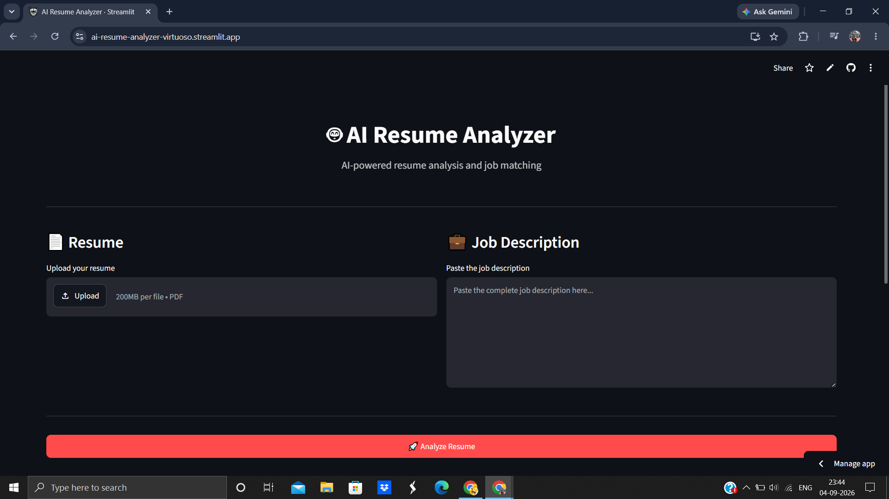
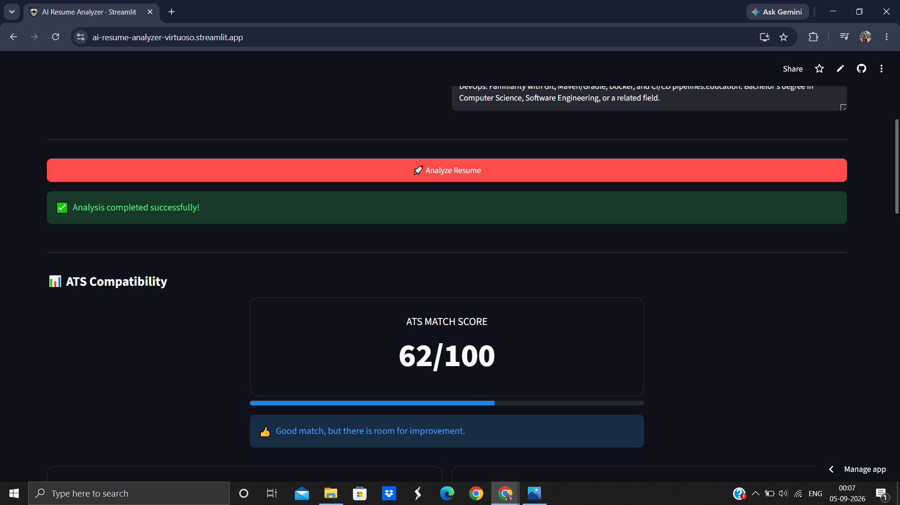
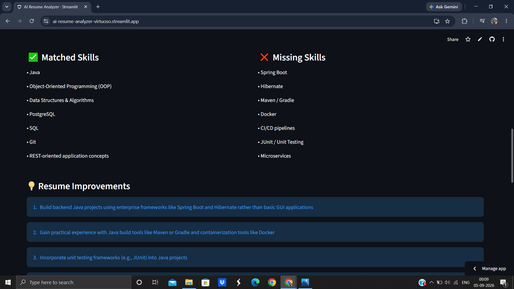
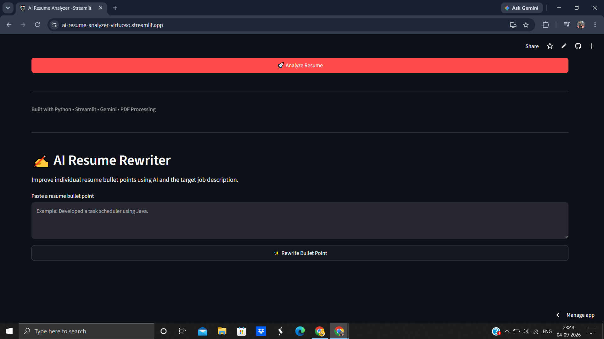
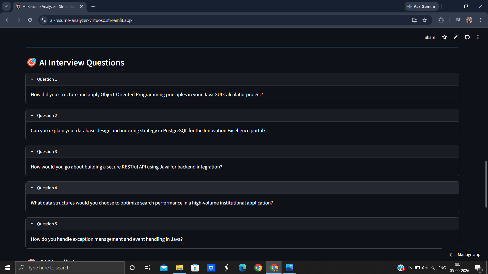

## 🌐 Live Demo

👉 [Try the AI Resume Analyzer](https://ai-resume-analyzer-virtuoso.streamlit.app/)

## 📸 Screenshots

### Resume Analysis Dashboard



# 🤖 AI Resume Analyzer & Job Match Assistant

## 🌐 Live Demo

🚀 **Try the application:** (https://ai-resume-analyzer-virtuoso.streamlit.app/)

📂 **Source Code:** (https://github.com/danishk3592/AI-Resume-Analyzer)


An AI-powered web application that analyzes a candidate's resume against a job description and provides an ATS compatibility score, skill-gap analysis, resume improvement suggestions, and interview questions.

## 🚀 Features

- 📄 Upload resume in PDF format
- 💼 Paste any job description
- 🤖 AI-powered resume analysis
- 📊 ATS compatibility score
- ✅ Matched skills detection
- ❌ Missing skills identification
- 💡 Personalized resume improvement suggestions
- 🎯 AI-generated interview questions
- 📥 Downloadable analysis report
- 🌐 Interactive Streamlit web interface

## 📸 Application Screenshots

### 🏠 Dashboard

The main interface allows users to upload a resume and provide a target job description.


### 📊 ATS Score Analysis

The application generates an AI-powered ATS compatibility score for the resume and target role.



### 🎯 Resume & Skill Analysis

The AI identifies matched skills, missing skills, and provides actionable resume improvement recommendations.



### ✍️ AI Resume Rewriter

Users can rewrite individual resume bullet points to make them more professional and job-relevant.



### 🎤 AI Interview Questions

The application generates role-specific interview questions based on the resume and job description.



## 💡 How It Works

1. User uploads a resume in PDF format.
2. The application extracts resume text using PyPDF.
3. User provides a target job description.
4. Gemini analyzes the resume against the job requirements.
5. The application generates an ATS score, matched skills, missing skills, improvement suggestions, and interview questions.
6. The AI Resume Rewriter generates improved, ATS-friendly resume bullet points.

## 💡 How It Works

1. User uploads a resume in PDF format.
2. The application extracts resume text using PyPDF.
3. User provides a target job description.
4. Gemini analyzes the resume against the job requirements.
5. The application generates an ATS score, matched skills, missing skills, improvement suggestions, and interview questions.
6. The AI Resume Rewriter generates improved, ATS-friendly resume bullet points.

## 🔮 Future Enhancements

- Resume keyword optimization
- Resume section-wise scoring
- Support for DOCX resumes
- Multiple job comparison
- Personalized cover letter generation
- User authentication and saved analyses
- Analytics dashboard


## 🛠️ Tech Stack

- Python
- Streamlit
- Google Gemini API
- PyPDF
- Python-dotenv
- Generative AI / NLP

## 🏗️ Architecture

```text
                 ┌─────────────────┐
                 │   User Resume   │
                 │      (PDF)      │
                 └────────┬────────┘
                          │
                          ▼
                 ┌─────────────────┐
                 │  PDF Extraction │
                 │     PyPDF       │
                 └────────┬────────┘
                          │
                          ▼
┌─────────────────┐   ┌─────────────────┐
│ Job Description │──▶│  Gemini AI      │
└─────────────────┘   │ Analysis Engine │
                      └────────┬────────┘
                               │
                               ▼
                 ┌────────────────────────┐
                 │ Resume Analysis        │
                 │                        │
                 │ ATS Score              │
                 │ Matched Skills         │
                 │ Missing Skills         │
                 │ Improvements            │
                 │ Interview Questions    │
                 └────────────────────────┘
                               │
                               ▼
                     ┌─────────────────┐
                     │ Streamlit UI    │
                     └─────────────────┘